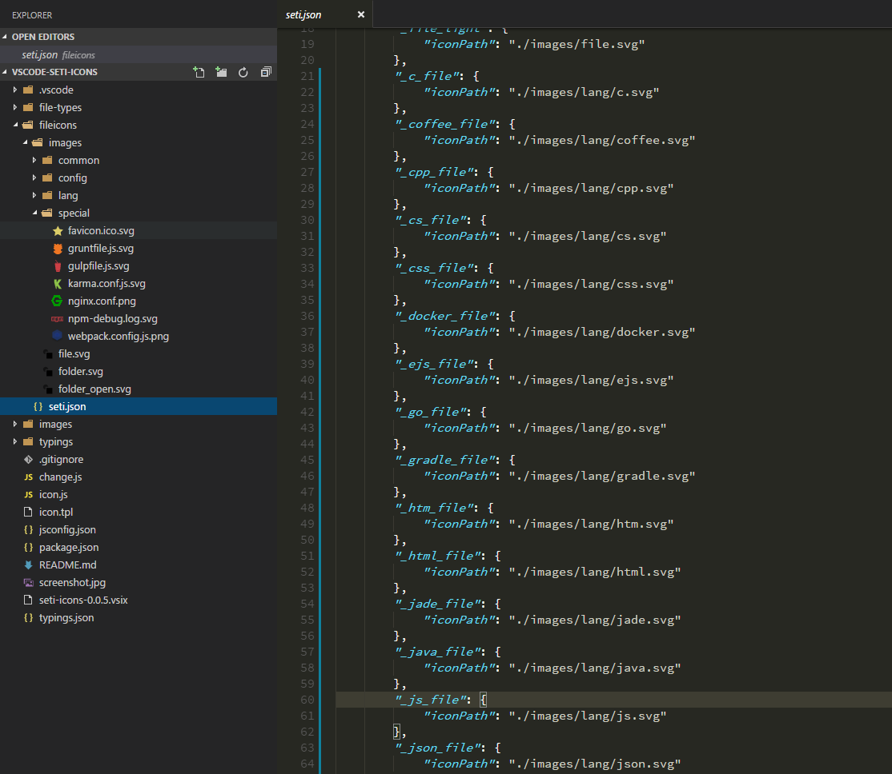

# seti-icons

Icons for VS Code (version 1.5.0+)

## usage 

    1. Open the command list (Press F1 or Ctrl + Shift + P)
    2. Select `File Icon Theme`
    3. Select `Seti UI`

## screenshot

## change log

- v0.0.8 

 1. add icons for folders(.vscode, typings, node_modules, .git)

 2. add icons for files(.pem, .key, .fs, .zip, .rar, .xcodeproj, .vue)